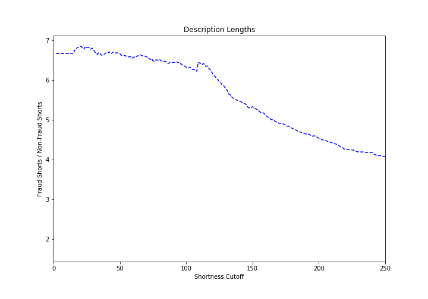
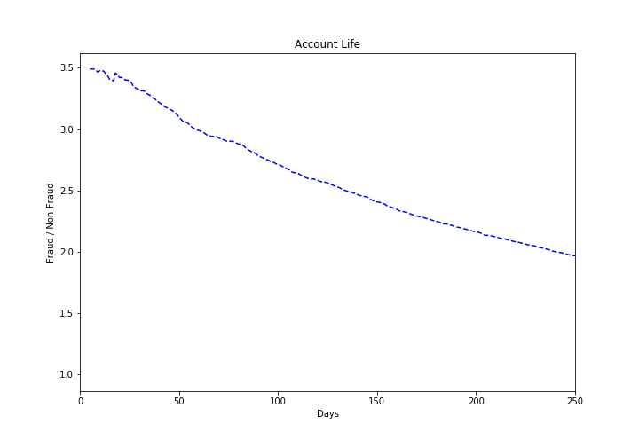
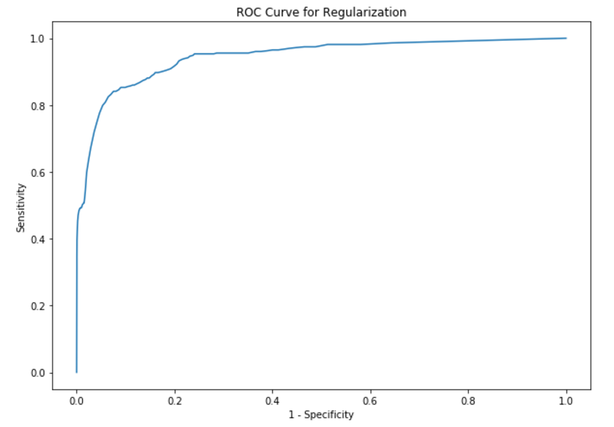

# fraud_detection_events
Fraud Detection Model for &lt;event-company>. Data is not included due to confidentiality.

---

# Pre-processing

---

Identify Fraudulent Response variable

```python
df['fraud'] = df['acct_type'].str.contains("fraud")
```

---

### Feature Selection

---
Short Descriptions ('body_length')

Fraudulent descriptions are most likely to have descriptions below 23 characters.



---
Account life

```python
df['account_life'] = df['event_created'] - df['user_created']
df['account_life'] = df['account_life'].dt.days
```

|"" | Account life|
|---|---|
Fraud| 87|
Non-Fraud| 402|

| Feature | Fraud | Not Fraud |
| --------| ----- | --------- |
| Account life| 82 | 402 (days)|
| fb_published(%)| 2| 13|
|org_facebook (mean)|1|8.6|
|org_twitter(mean)|0.29|4.6|
|has_analytics(%)|0.3|8|
|payout_type (exists %)|65|99|
|previous_payout (mean of amount)|183|2340|
|listed(%)|83|85|
|has_header (%)|7| 21|
|show_map (%) |75 | 85|
|has_logo (%)| 64| 86 |


The 87 days are likely due to fraud being identified late.



It is better to leave this as a scaled linear feature.

# Data Pipeline
_Used for coworking in git using merges_


---

# Logistic Regression

Fit and tested on a ROC curve


